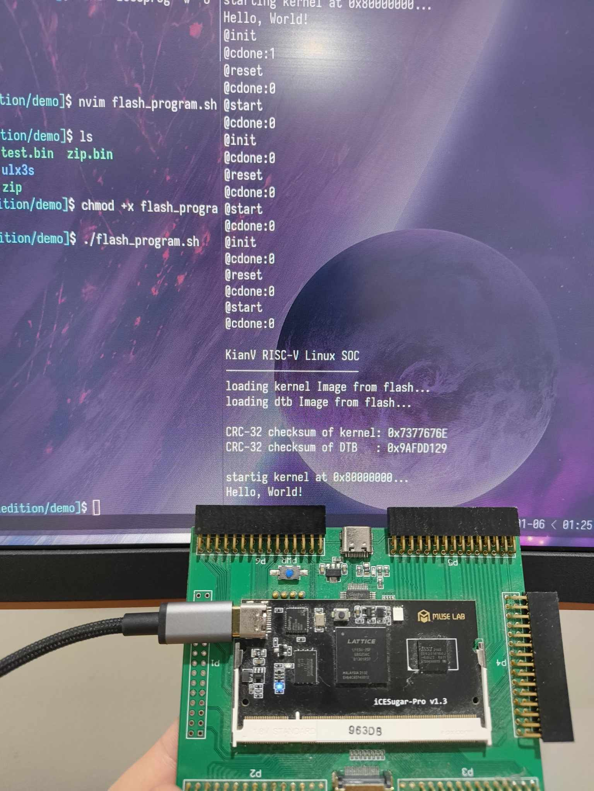

# Embedded Zig Part 2 - Hardware Time?
[Home](../../index.html) [Blog Index](../blog.html)

Ryan Ward, January 2025

## Introduction
In my [previous post](../0001_embedded_zig/embedded_zig.html), we set up a very basic embedded
Zig program running on an emulated RISC-V processor. Whilst I used the term 'baremetal' in the previous
post, I would not count running a program inside an emulator on a host OS close to the hardware at all.
So, lets run our Zig program on some actual RISC-V hardware! I don't have a SiFive or RP2350 CPU
at my immediate disposable, but I do have a Lattice ECP5 FPGA sitting on top of an [icesugar-pro](https://github.com/wuxx/icesugar-pro) development
board. If you didn't already know, the RISC-V specification is an open standard instruction set architecture,
meaning that anyone can implement their own custom CPUs or SoCs! This is incredible, and whilst it is
still early days, I really hope to see it progress in the next few years, to the point where it becomes
an ARM contender.

I have not yet attempted to implement the RISC-V standard (but it is on my bucket list), however, I
have been following [`@splinedrive`](https://x.com/splinedrive) on the everything app, a super talented
embedded systems engineer building RISC-V SoC, the [KianV](https://github.com/splinedrive/kianRiscV).
Best of all, it's open-source, and supports the icesugar-pro board I have sitting on my desk!

## Some prerequisites
If you decide to follow along, there are some things you need to do before continuing (for everything
to make sense):

- Obtain an icesugar-pro (or any equivalent FPGA or RISC-V SoC)
    - If using an icesugar-pro, obtain the [icesprog](https://github.com/wuxx/icesugar/tree/master/tools) programming firmware.

- Read the [previous post](../0001_embedded_zig/embedded_zig.html)

- Clone the [KianV repository](https://github.com/splinedrive/kianRiscV)

- Install [`tio`](https://github.com/tio/tio) on your host system

- Install the [newlib RISC-V GCC toolchain](https://github.com/riscv-collab/riscv-gnu-toolchain)

I have chosen to use the [`kianv_harris_mcycle_edition`](https://github.com/splinedrive/kianRiscV/tree/master/linux_socs/kianv_harris_mcycle_edition)
SoC, as it had everything I needed to program my development board - a bitstream, a bootloader, and a handy flash script!
In the future, I might write a post about using tools to synthesize and implement a bitstream to use
on the FPGA.

## Small tweaks
We had it pretty good with QEMU, where we can just hammer the UART data register with bytes, and it'll
handle it just fine. This is not the case when running on actual hardware (hardware is hard). If we don't
wait for the UART device to finish a 'data cycle', it will miss some characters we write to the data buffer, and
a garbled string will appear at the output. Luckily, we can wait until the UART device is ready by busy-waiting
for bits 5 and 6 of the Line Status Register.

Similar to the QEMU emulator, the KianV also provides a 16550 UART device, conveniently
at the [same address](https://github.com/splinedrive/kianRiscV/blob/master/linux_socs/kianv_harris_mcycle_edition/defines_soc.vh#L25)!
Therefore, we only need to find the offset of the Line Status Register, and using an [online datasheet](https://caro.su/msx/ocm_de1/16550.pdf),
it is at offset `0x05`. We want to loop while bits 5 and 6 of the register are 0, as that means the UART transmitter
is full, and won't be able to read and send any new data. The modified code is below:

```zig
fn print(message: []const u8) void {
    // The uart device on the KianV is at address 0x10000000
    const uart_register_address: usize = 0x10000000;
    const uart_lsr_offset: usize = 0x05;

    // Set the uart data out to the above address
    const uart_data_out: *volatile u8 = @ptrFromInt(uart_register_address);

    // Line status register
    const uart_lsr_reg: *volatile u8 = @ptrFromInt(uart_register_address + uart_lsr_offset);

    // Iterate through the given slice, and set the data out to the current character
    for (message) |character| {
        while ((uart_lsr_reg.* & 0x60) == 0) {}
        // If the the incoming character is an ASCII carriage return, convert to ASCII line feed
        uart_data_out.* = if (character == 0x0D) 0x0A else character;
    }
}

// Export the Zig entry point so the symbol exists in assembly land
export fn start() noreturn {
    print("Hello, World!\n");
    while (true) {}
}
```

The linker script can also be cleaned up a little bit from our previous implementation.
```
OUTPUT_ARCH("riscv")
ENTRY(_start)

BASE_ADDRESS = 0x80000000;

SECTIONS
{
    . = BASE_ADDRESS;
    .text : {
        . = ALIGN(4);
        *(.text .text.*);
    }

    .rodata : {
        . = ALIGN(4);
        *(.srodata .srodata.*);
        . = ALIGN(4);
        *(.rodata .rodata.*);
    }

    .data : {
        . = ALIGN(4);
        *(.sdata .sdata.*);
        . = ALIGN(4);
        *(.data .data.*);
    }

    .bss : {
        . = ALIGN(4);
        *(.sbss .sbss.*);
        . = ALIGN(4);
        *(.bss .bss.*);
    }

    PROVIDE(_bss_start = ADDR(.bss));
    PROVIDE(_bss_end = _bss_start + SIZEOF(.bss));
    PROVIDE(_stack_top = _bss_end + 0x1000);
}
```
Most of the above content is similar to the previous version, however, after looking at some other
RISC-V linker scripts ([1](https://github.com/splinedrive/kianRiscV/blob/master/linux_socs/kianv_harris_mcycle_edition/bootloader/kianv.ld), [2](https://github.com/YosysHQ/picorv32/blob/main/picosoc/sections.lds)), we can just align everything to 4 bytes, and include/expand all sections.

Next, we need to edit line 1 in the `init.S` file to move the startup procedure to the `text` linker section:
```
--- .section .init
+++ .section .text
```

Finally, let's change the target CPU model to a generic RV32 system, with no extensions. On line 24,
change the cpu model:
```
--- .cpu_model = .{ .explicit = &std.Target.riscv.cpu.baseline_rv32 },
+++ .cpu_model = .{ .explicit = &std.Target.riscv.cpu.generic_rv32 },
```

As always, the code can be found on [my GitHub](https://github.com/rwardd/rwardd.github.io/tree/main/blog/0002_zig_on_hardware/demo).

## Let's build
Once everything has been updated, we should simply be able to:
```bash
$ zig build
```

The output executable is in an ELF format, and we need to change it to a binary format to run on
our softcore SoC:

```bash
$ riscv32-unknown-elf-objcopy -O binary zig-out/bin/main main.bin
```

## Programming the FPGA
We now have everything we need to program the FPGA with our program. Navigate to the `kianRiscV/linux_socs/kianv_harris_mcycle_edition/demo`
directory, copy our `main.bin` executable over and create a new executable shell script with the following:
```bash
$ touch flash_program.sh
$ echo "icesprog -w -o $((1024*1024*1))  boot.bin
icesprog -w -o $((1024*1024*2))  main.bin
icesprog -w ./icesugar-pro/soc_70Mhz.bit
" > flash_program.sh
$ chmod +x flash_program.sh
```
***Please Note***: Technically, we should be recompiling the bootloader to make it compatible
with our binary. However, it is simply just moving our binary to an expected place in memory (address 0x8000000), and calling
the initialisation function that exists at that address. The function signature that the bootloader calls passes in two arguments,
but our `_start` function (the function at address 0x80000000) doesn't expect any arguments. In this case,
the arguments (which are loaded into registers) simply get ignored. This is terrible practice, but
recompiling the bootloader is out of scope for this article :)

## Let's run it!
Ok, now that we have everything set up, let's program our device, and view the serial output using
`tio`. It might help to open two terminals for this process. With our device plugged in:

On terminal 1 (press tab to autocomplete, the serial number is quite large):
```bash
$ tio -m INLCRNL /dev/serial/by-id/usb-MuseLab_DAPLink_CMSIS-DAP_<serial_number> -b 3000000
```

On terminal 2:
```bash
$ ./flash_program
```

With any luck, we should see some bootloader output, and once our "kernel" is loaded, it should print
those awesome letters:
```
Hello, World!
```



## Fin
I'm having a lot of fun writing these articles, and will try to keep posting more! Any questions, feedback
or comments, feel free to send me an email (rwardd@outlook.com.au) or [message me on x dot com](https://x.com/crank1_).
So far, these posts have developed from the scheduler (RTOS-to-be) I am writing to learn Zig, which you can
find on [my GitHub](https://github.com/rwardd/zip).
